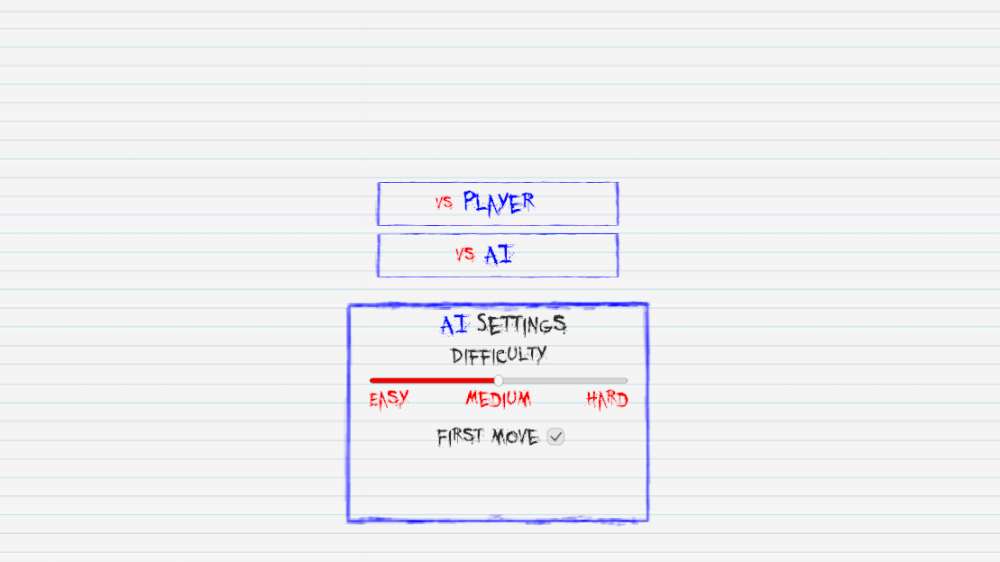
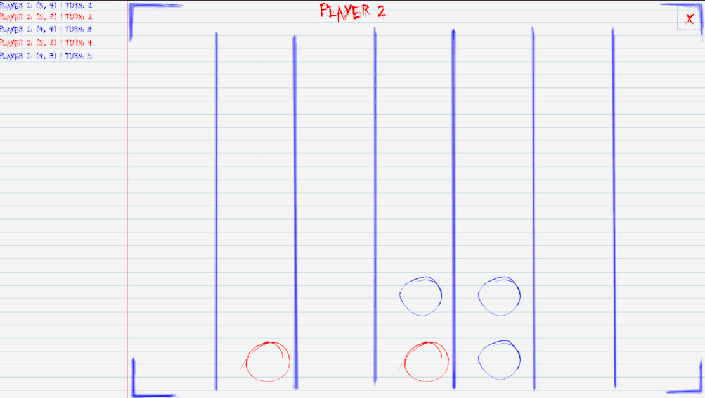

# Connect-4-Game
A classic Connect-4 tabletop game version via Unity3D in the style of a school notebook.

Features:
- One vs One
- One vs AI
- AI uses Monter carlo tree search to decide on next move
- Adjustable AI parameters to improve its selection
- Notebook style desktop-only UI
- Ballpoint pen drawing animation of circles on board
